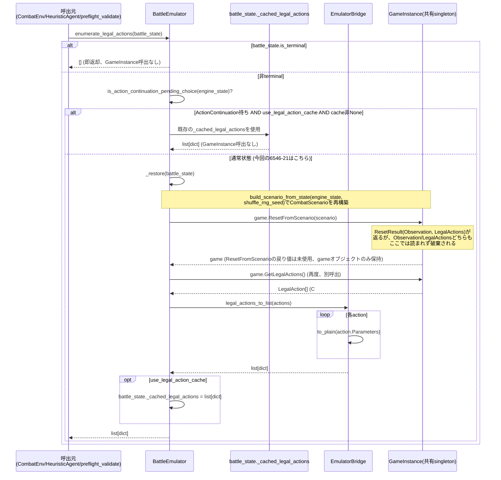

# `enumerate_legal_actions()` — 呼出元から返却までの詳細トレース

対象: `Combat/battle_emulator.py::BattleEmulator.enumerate_legal_actions()`
(830-849行)。全ての「合法手を知りたい」呼出はこの一関数に収束する
(`CombatEnv.get_legal_actions()`、`HeuristicAgent.choose_action_with_detail()`、
`preflight_validate()`が直接・間接に呼ぶ唯一の経路)。

## 入力

* `battle_state: BattleState` — 呼出元が保持しているPython側スナップショット
  (`engine_state`辞書 + `is_terminal` + `_cached_legal_actions`等)。
  **新規GameInstanceの生成はしない** — 常に`emulator_bridge.shared_game_instance()`
  が返す単一の共有インスタンスを使う。

## フロー

## 明記事項

* **入力されるstate**: 呼出元が保持する`BattleState.engine_state`(前回の
  `Step()`結果、または`initialize()`結果から`to_plain()`済みのPython辞書) —
  GameInstance自体からではなく、常にPython側スナップショットから再構築する。
* **`build_scenario_from_state()`の有無**: **あり**(通常状態の場合、常に呼ばれる)。
  ActionContinuation待ち+キャッシュヒットの場合のみ呼ばれない。
* **`ResetFromScenario`の有無**: **あり**(同上の条件)。
* **fresh GameInstance生成の有無**: **なし** — 常に`shared_game_instance()`の
  単一インスタンスを再利用(`ResetFromScenario`で中身を丸ごと入れ替えるだけ)。
* **restore時に渡す全フィールド**: `state_restore_coverage.csv`参照
  (HP/Block/Energy/Stars/Hand・Draw・Discard・ExhaustPileCards/Potions/Orbs/
  PendingChoice(条件付き)/PlayerPowers/Relics(idのみ)/Seed)。
* **restore後に自然発火する処理**: `game.ResetFromScenario(scenario)`の
  戻り値(`ResetResult.Observation`/`LegalActions`)は**このパスでは全く
  読まれない** — 呼出元が実際に使うのは直後の`game.GetLegalActions()`
  という**別の**呼出の結果。つまり1回のenumerate_legal_actions()呼出で
  GameInstanceへの往復は実質2回(`ResetFromScenario`+`GetLegalActions`)。
  `ResetFromScenario`自体がEmulator内部でどのような処理(start-of-combat/
  turn-start相当のhook)を発火させるかはRL側コードからは不可視 —
  **未確認**。
* **LegalActions取得後にGameInstanceをどう扱うか**: 何もしない
  (disposeやcloseの概念はこのAPIに存在しない)。次にこの共有インスタンスへ
  アクセスする呼出(次のenumerate_legal_actions()やapply_action())が
  改めて`ResetFromScenario`で上書きする。
* **呼出頻度**: 1 decisionあたり最低1回(`CombatEnv.get_legal_actions()`)。
  Heuristic評価では候補ごとに`apply_action()`経由で追加の
  `enumerate_legal_actions()`呼出は発生しない(候補スコアリングは
  `apply_action()`を直接呼ぶため、こちらの関数自体は候補ループの外で
  1回だけ)——ただし`apply_action()`内部の`_restore()`は候補ごとに
  ほぼ同一の処理を行う(詳細は`heuristic_sequence.md`)。

## 冗長呼出の指摘(既知の非効率、原因究明ではなく事実の記録)

`ResetFromScenario`は`ResetResult`として`Observation`と`LegalActions`の
**両方**を1回の呼出で返す設計になっている(`initialize()`はこの戻り値を
実際に使っている — `battle_emulator.py:675-679`参照)。しかし
`_restore()`(698-701行)はこの戻り値を完全に捨てて`game`オブジェクトだけを
返し、呼出元(`enumerate_legal_actions()`)が**改めて**`GetLegalActions()`を
呼んでいる。理論上は`_restore()`の戻り値に`ResetResult`自体を含めれば
この2回目の呼出は省略できる可能性がある — ただし本タスクでは実装変更は
行わない(9節「変更禁止」)。`known_risks.md`の「状態変換コスト」項目に
記載。
