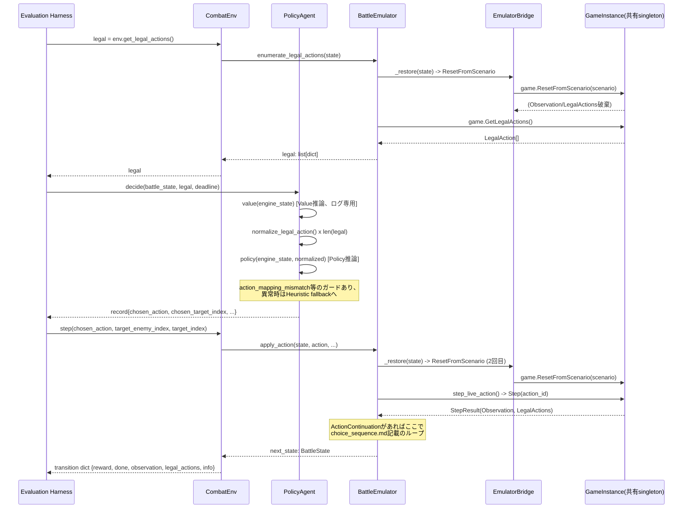
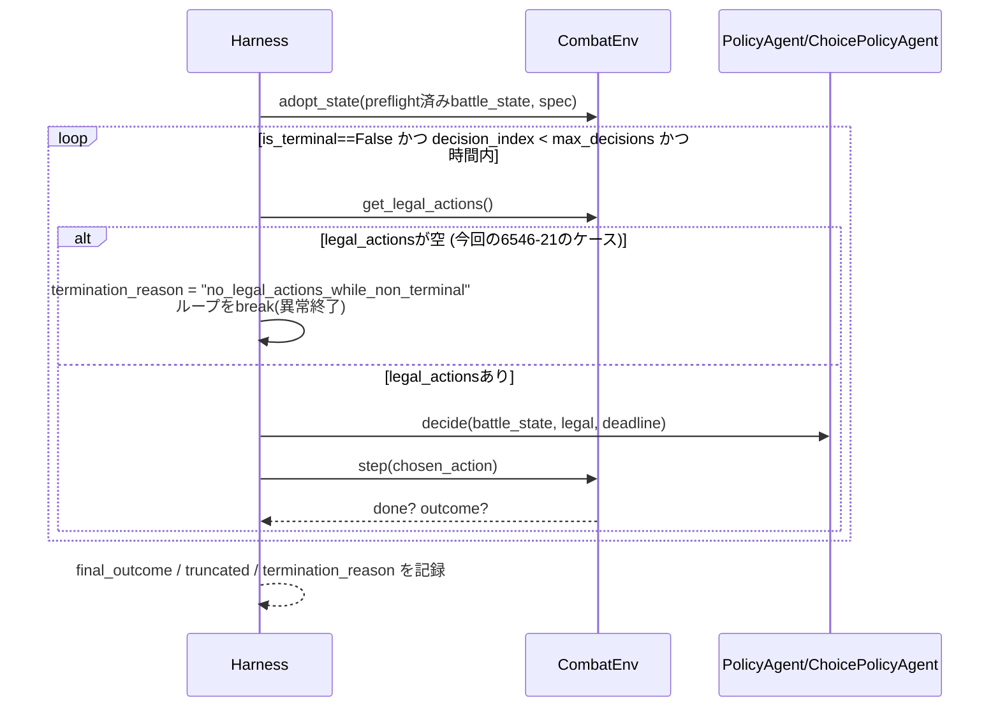

# 通常オンライン戦闘 — 詳細処理フロー(A節)+ Scenario 6546-21障害フロー(6節)

## A. 通常オンライン戦闘全体(概念フロー)

```text
Scenario開始 (preflight_validate -> CombatEnv.adopt_state)
  -> decisionループ開始
     -> legal = env.get_legal_actions()  [legal_actions_sequence.md]
     -> 通常Policy (card/potion/system) または
        Choice Policy / Heuristic fallback (choice_*)  [choice_sequence.md]
     -> Value推論 (log-only、行動選択には使わない)
     -> env.step(chosen_action)  [ActionContinuationは同一step()内で自動吸収]
     -> 次decisionへ、または terminal/truncated で終了
```

## シーケンス図: 通常Policyの1 decision(card/potion/system)



## シーケンス図: Choiceを含む1 decision

`choice_sequence.md`参照(独立ファイルとして分離、E節の要求通り)。

## シーケンス図: Heuristic shadow比較を含む1 decision

`heuristic_sequence.md`のF節参照。

## シーケンス図: terminalまでの1戦闘(概略)



---

## 6. 今回の問題の処理フロー — Scenario `6546-21`

### 確認済み事実(コード上・再現ログ上、根拠あり)

1. `decision_index=13`時点で`env.get_legal_actions()`が空リストを返す一方、
   `env.battle_state.is_terminal=False`(出典: `investigate_no_legal_actions_
   6546_21.py`実行ログ、`rl_no_legal_actions_investigation_6546-21_20260725.md`)。
2. その時点の状態: 敵`SOUL_NEXUS`(hp=5、`isAlive=true`)、
   プレイヤーhp=68/78、block=166、energy=3、`turnNumber=1`、
   `combatRoundNumber=1`、`pendingChoice=null`、手札10枚
   (同上、`rl_no_legal_actions_investigation_6546-21_20260725.md`2節)。
3. この状態に至るまでの13手は**一度もEnd Turnを選んでいない**
   (`DRAMATIC_ENTRANCE`→`DELAY`→`PULL_AGGRO`→`GRAVE_WARDEN`×2→
   `DEFEND_NECROBINDER`→`DRAMATIC_ENTRANCE`→`LETHALITY`→`VEILPIERCER`→
   `DEFEND_NECROBINDER`→`HIGH_FIVE`→`DEFEND_NECROBINDER`→`BLOCK_POTION`、
   全てcard/potion/choice_card、system(End Turn)は皆無)。
4. Scenario `6546-21`のspecには`TOOLBOX`と`FESTIVE_POPPER`が**両方とも
   relicsリストに含まれている**(今回`choice_policy_online_eval_manifest.
   jsonl`を直接確認して新規確認 — 他13種のrelicと共に、計15relic)。
5. `Combat側の3経路(CombatEnv経由/BattleEmulator直接/完全新規restore)
   全てで同一の0件`(`rl_no_legal_actions_investigation_6546-21_
   20260725.md`3節、Combat側要因は除外済み)。
6. `build_scenario_from_state()`は**relicをidリストのみ**で送る
   (`state_restore_coverage.csv`の「one-shot relic/powerの消費状態」行)。
7. `initialize()`のコードコメントにより、**`ResetFromScenario`は
   毎回engineの内部turn数を1にリセットする**ことが明言されている
   (`battle_emulator.py:670-673`)——これは`_restore()`(=毎decisionの
   `enumerate_legal_actions`/`apply_action`)にも同様に当てはまる
   (同じ`ResetFromScenario`呼出だから)。
8. `preflight_validate()`によるspec対state内容突合は**`initialize()`直後の
   1回のみ**——decision_index=1以降の`_restore()`はこの突合を一度も
   受けていない(`state_lifecycle.md`「どの変換が可逆と仮定されているか」)。

### 未確認の仮説(コード上の根拠から推測されるが、本タスクでは追加調査していない)

```text
Step後の正しいlive state
→ Python engine_state保存 (to_plain、_wrap)
→ [次decision] enumerate_legal_actions呼出
→ build_scenario_from_state (relic idのみ、turn数情報なし、PlayPile欠落)
→ ResetFromScenario (エンジンにとってはturn 1の"新規"combat開始と区別不能)
→ ??? TOOLBOX／FESTIVE_POPPER関連の "start of combat" 相当hookが再発火 ???
→ ??? turn-start effect再発火 ???
→ ??? SOUL_NEXUSに何らかの特殊状態遷移 ???
→ LegalActions 0
```

* **未確定**: 上記チェーンの`???`部分は一切確認していない
  (「追加調査や修正は行わない」という本タスクの制約による)。
  特に以下は**未確定のまま明記する**:
  * **FESTIVE_POPPER単独では再現しない理由**: 検証していない。
    `FESTIVE_POPPER`単独/`TOOLBOX`単独/両方あり/両方なしの4パターンを
    比較する実験は今回実施していない。
  * **TOOLBOXとの組み合わせ条件**: 同上、未検証。両relicが**同時に**
    存在することが必要条件か、片方だけで十分かは不明。
  * **どの復元処理がturn-start hookを再発火させるか**: `ResetFromScenario`
    自体の内部実装(C#側)は本タスクの参照範囲外——RL側コードからは
    「turn数がリセットされる」という**外部から観測できる事実**までしか
    確認できず、それが「turn-start hookの再発火」を引き起こすかどうかの
    因果関係そのものは**Emulator側ソースコードの調査なしには確認不能**。
* **重要な矛盾点(確認済み事実との不整合)**: 前回の作業指示に含まれていた
  仮説的フロー例では最終段が「SOUL_NEXUS死亡」となっていたが、
  実際に再現・記録された確認済み事実(上記1-2)では**SOUL_NEXUSはhp=5で
  生存中(`isAlive=true`)**であり、`is_terminal=False`のままlegal actionsが
  0件になっている。「モンスターが死亡したことによる終了判定の遅れ」という
  仮説は、**今回確認された実際の状態とは一致しない**——素直な
  `normal_terminal_detection_issue`(死亡を検出できていない)という
  単純な説明では説明しきれない(hp=5>0で本当に生存しているため)。
  この矛盾は解消していない、というより**未解消のまま次回監査へ引き継ぐ**
  べき論点として記録する。

### 分類(再掲、`rl_no_legal_actions_investigation_6546-21_20260725.md`より)

第一候補: `emulator_legal_action_bug`。次点候補: `normal_terminal_detection_issue`
(ただし上記の矛盾点により、この次点候補は単純な形では成立しない可能性がある —
「死亡検出漏れ」以外の何らかの内部不整合という、より広い意味での
"terminal判定/legal action生成ロジックの整合性問題"として捉え直す必要が
あるかもしれない、という**未確定の但し書き**付き)。
