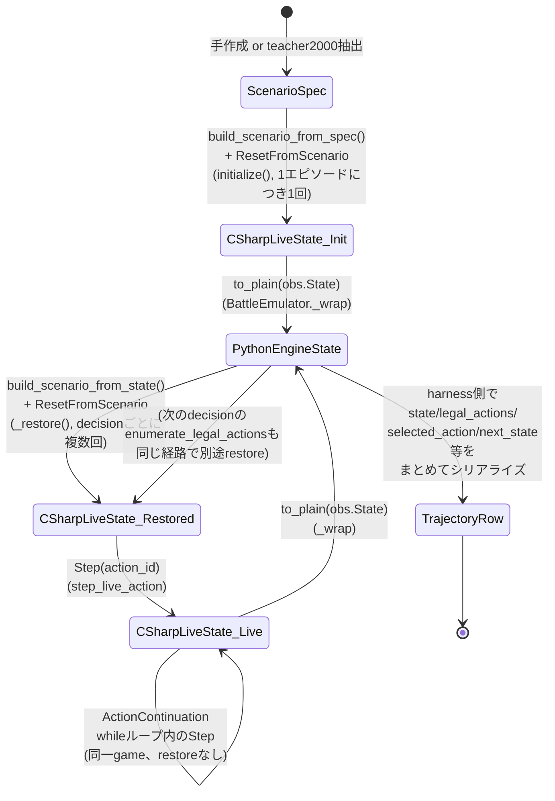

# 状態ライフサイクル図 + trajectory生成(G節)

## 状態表現の区別

| 表現 | 実体 | 生成/消費箇所 |
|---|---|---|
| C# live combat state | `GameInstance`内部の実行時オブジェクトグラフ(CombatState等、Combat側からは不可視) | `ResetFromScenario`/`Step`が内部で更新。RL側コードはこの内部表現を直接読めない — 常に`GetObservation`/`ResetResult.Observation`/`StepResult.Observation`経由でのみ観測可能 |
| C# Observation | `GameObservation`(.NET オブジェクト、`IsTerminal`/`Outcome`/`Turn`/`State`を持つ) | `ResetFromScenario`/`Step`の戻り値(`ResetResult.Observation`/`StepResult.Observation`)として都度生成される、GameInstanceに保持されない一時オブジェクト |
| Python engine_state | `to_plain(obs.State)`で作られるプレーンなPython dict(`emulator_bridge.py:100-125`) | `BattleEmulator._wrap()`(589-647行)が全ての`initialize()`/`step_live_action()`呼出後に生成。以後はこの辞書がPython側の「正」の状態表現として保持・受け渡しされる |
| Scenario spec | `Common/schemas/combat_scenario_input_schema.json`形式の手作成/再構成済み辞書 | `scenario_set.py`(手作成)または`build_choice_teacher_data_manifest.py`等の抽出スクリプト(teacher2000由来) |
| restored C# combat state | `build_scenario_from_state(engine_state)` -> `CombatScenario` -> `ResetFromScenario`で再構築された、新しいC# live combat state | `BattleEmulator._restore()`が毎回新規に生成 — 直前のrestored stateとは(理論上は)別の内部オブジェクトグラフ |
| trajectory row | teacher-data/オンライン評価ログの1行(JSONL) | `generate_heuristic_trajectories.py`/`online_policy_eval.py`/`choice_policy_online_eval.py`等が、Python engine_stateを主とした複数フィールドをまとめてシリアライズ |

## ライフサイクル図

## どの変換が可逆と仮定されているか

* **ScenarioSpec -> C# live state -> Python engine_state**: 部分的に可逆と
  「検証」されている——ただしこれは`initialize()`直後の**1回だけ**
  (`preflight_validate.py`がspec対state内容を突合、HP/deck/relics/potions/
  powers/orbs/enemies/slot names/starsを比較)。**それ以降の`_restore()`は
  一度もこの突合を受けない** — spec由来の初回検証結果が、以後の全ての
  中間restoreにもそのまま当てはまるという**暗黙の仮定**の上で
  パイプライン全体が組まれている(`known_risks.md`参照)。
* **Python engine_state -> C# restored state -> 次のPython engine_state**:
  `build_scenario_from_state()`が可逆と仮定して設計されている
  (docstring: 「what every apply_action()/_restore() call uses to replay
  one more step from a BattleState snapshot」)。ただし
  `state_restore_coverage.csv`が示す通り、この往復は**フィールド単位で
  可逆性が異なる**——HP/Block/Energy/Hand・Draw・Discard・Exhaust
  Pile(構成・アップグレード状態)/Potions/Orbsは完全可逆、
  Relics/one-shot消費状態/turn数/RNGカーソル/PlayPileは**不可逆**
  (常にidのみ・turn1・原シード・欠落のいずれかへ収束する)。
  「Python engine_stateを保持していれば、いつでも同じ状況を100%
  再現できる」という前提は、この不可逆フィールド群については
  **成立しない**。

## G. trajectory生成

対象: `Combat/data/generate_heuristic_trajectories.py::generate_trajectory()`
(teacher2000本体)、同型パターンを踏襲する
`Combat/evaluation/online_eval/generate_choice_teacher_data.py`
(Choice教師データ)。

* **parent Scenario**: `Combat/data/teacher2000_20260723_manifests/
  parent_2000_manifest.jsonl`の`spec`フィールド(元の`ScenarioSpec`)。
  各`trajectory_id`は`(source_run_id, source_combat_index)`で
  parent manifestの1行と対応付けられる。
* **transition保存**: 1 decisionにつき1行、以下を保存
  (`generate_heuristic_trajectories.py`の`decisions.append(...)`ブロック、
  `TRAJECTORY_FIELDS`相当):
  `trajectory_id`/`source_run_id`/`source_combat_index`/`decision_index`/
  `emulator_version`/`scenario_hash`/`state`/`legal_actions`/
  `selected_action`/`selected_action_index`/`selected_enemy_index`/
  `action_scores`/`decision_budget_exceeded`/`elapsed_ms`/
  `evaluated_action_count`/`total_legal_action_count`/
  `total_candidate_count`/`search_depth_reached`/`fallback_used`/
  `fallback_reason`/`reward`/`next_state`/`done`/`outcome`/
  `heuristic_version`/`random_seed`/`warnings`。
* **pre-state/post-state**: `state`(=`state_before`、action適用**前**の
  `engine_state`)と`next_state`(=action適用**後**、`result["observation"]
  ["state"]`)。両方ともPython engine_state表現(前節参照) — C# live state
  そのものは保存されない。
* **legal actions**: `state`と同時点の`legal`リストをそのまま保存
  (`enumerate_legal_actions()`の出力、`legal_actions_sequence.md`参照)。
* **terminal outcome**: `next_state`側の`outcome`/`done`(=`is_terminal`)。
* **truncated**: `generate_trajectory()`の`truncated`フラグ
  (`max_decisions`到達 or `max_wall_seconds`到達 or `no_progress_detected`
  等、terminal**ではない**理由での打ち切り)。
* **restore可能性**: 保存される`state`/`next_state`は
  「`build_scenario_from_state()`を使えば理論上再構築できる」という
  前提のPython engine_stateだが、上記の「どの変換が可逆と仮定されているか」
  の通り、**完全な可逆性は保証されていない** — 特にone-shot消費状態/
  turn数/RNGカーソルは保存されたstateから再現できない。
* **ActionContinuation Choiceの記録位置**: **teacher2000本体
  (`generate_heuristic_trajectories.py`)には記録されない** —
  `continuation_resolver=agent._choose_action_continuation_live`は
  ロギングなしで直接渡され、継続中の各選択は`decisions`列に一切現れない
  (`build_choice_scenarios_manifest.py`が最初に指摘した既知の事実)。
  Choice教師データ生成(`generate_choice_teacher_data.py`)・Choice
  Policyオンライン評価(`choice_policy_online_eval.py`)では、この同じ
  `continuation_resolver`引数にロギング用ラッパー
  (`make_logging_continuation_resolver_full`/`make_ab_continuation_
  resolver`)を差し込むことで、`decision_index`(外側の実決定番号)+
  `continuation_step_index`(同一決定内の連番)として**別のsink**
  (`choice_decisions`/`continuation_choices`)に記録している —
  主trajectory列(`decisions`)とは異なる記録位置。
