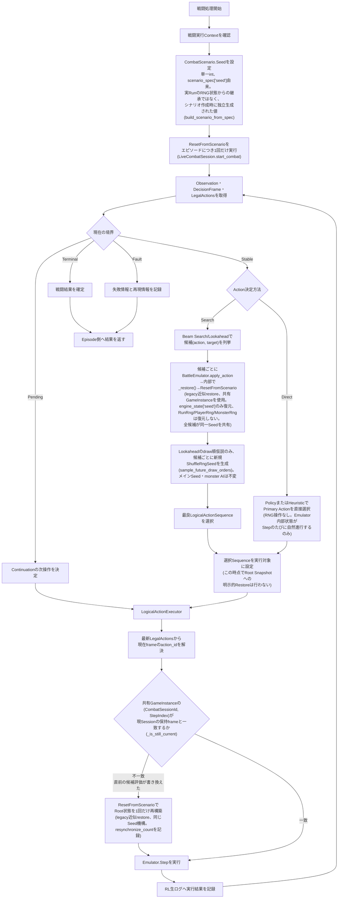
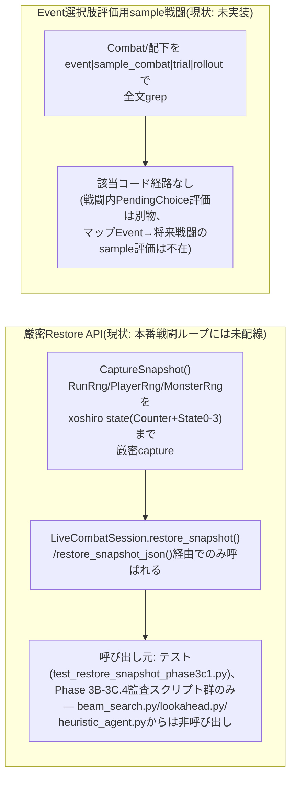

# RL担当 戦闘RNG取扱い調査報告 — 「1. RL全体フロー」戦闘部分のMermaid図示 (2026-07-31)

対象: 「RL担当作業指示 — 「1. RL全体フロー」の戦闘RNG取扱いの図示」。**本ラウンドは調査と
文書化のみ。runtimeコードは一切変更していない**(`git status --short`で無変更を確認済み、
本報告書ファイル追加のみ)。

## 0. 調査開始時点の基準情報

- RL HEAD: `afcd99d`(指示書記載の基準と一致)
- RL tag: `rl-phase3c34-python-accepted-20260730`ではなく`rl-phase3c34-python-accepted-20260731`
  (指示書記載どおり、`afcd99d`を指す)
- 使用DLL SHA256(調査開始時点、`C:\STS2_Emulator\Sts2Emulator.Cli\bin\Debug\net8.0\
  Sts2Emulator.dll`): `c0ffd64365cfaba9659bc5bf710470fcd637eb4d45ecd2dc71552b286018e40f`
  — **注意**: これはPhase 3C.4.1監査時点のDLLハッシュ(`f79a91925c75f05bacaecdf5f614bdea01
  ad6c8f65f55d0e9585eff4d1074ecc`)と異なる。Emulator側リポジトリを確認したところ、
  `3c5139b`(`Merge docs/combat-state-snapshot-patch-20260731`)まで進んでおり、公式JSON例へ
  History付きの実Capture例を差し替え、`unknown_combat_history_entry_type`を文書化する変更
  (`84d6d86`/`a145067`/`c99e7ef`)が入っている——これはRL側のcontract v0.8 §9-D/§9-Eが
  次ラウンドへの申し送り事項として記録していた2件の指摘に対応するEmulator側の追従修正であり、
  RestoreSnapshot本体の挙動変更ではないと推定される(本ラウンドはRNG取扱いの調査のみのため、
  この差分自体の詳細検証は範囲外とし、事実として記録するに留める)。
- Contract v0.8 SHA256(LF正規化後、`combat_state_contract.v0.8.md`):
  `30fcfaaa0cf51b684471de376c81d1306a1ba07460b440c850ec88778b7073c2`(RL側で直近commitした
  値と一致)
- Emulator JSON Schema SHA256(`combat_state_snapshot.schema.json`):
  `6bc628af6219a98ef8bb34c31e9d9d6c326606ae19b08d6da09a8722ad9227fc`(Phase 3C.4.1監査報告の
  値と一致——Emulator側の直近commitはJSON例/文書のみでSchema自体は無変更と推定される)

## 1. 参考にした既存の下書きMermaid図について

`C:\STS2_RL\mermaid2 beamsearch.txt`および`C:\STS2_RL\mermaid3.txt`(いずれも本リポジトリ
直下に配置済み、未commit)を確認した。両ファイルとも、Beam Searchの各枝がRoot Stable
Snapshotへ**明示的に`RestoreSnapshot`する**という設計を前提にしている。**これは現行実装の
挙動ではなく、将来の移行先として想定されている設計である**——詳細は§4で述べる通り、現行の
`beam_search.py`/`lookahead.py`はSnapshot Capture/Restore APIを一切呼ばず、代わりに
legacy `BattleEmulator.apply_action()`/`_restore()`(`Seed`のみを使うapproximate restore)
を使用している。本報告書の図は「現行実装が実際に行っていること」を示すものであり、
`mermaid2`/`mermaid3`が示す「将来設計」とは意図的に区別している。

## 2. 調査結果(6項目、根拠付き)

### 2-1. 通常Runから開始される戦闘のRNG初期化

エピソード開始時にRNGに関係する唯一の値は`CombatScenario.Seed`(単一int)である。

- `Combat/live_combat_session.py:423-433`(`start_combat`)——`build_scenario_from_spec
  (scenario_spec)`でScenarioを構築し、`self._game.ResetFromScenario(scenario)`を
  **エピソードにつき1回だけ**呼ぶ(モジュールdocstring、同ファイル1-9行が明記)。
- `Combat/battle_emulator.py:596`(`build_scenario_from_spec`)——
  `scenario.Seed = int(spec.get("seed", 1))`。
- このseed値は、実際のRun(実行中のメタ進行)が保持しているRNG状態から**由来しない**——
  `RestoreSnapshot`経由でも取得されない。`Combat/data/scenario_from_runs.py:207`と
  `Combat/data/reconstruct_floor_state.py:499`はいずれも`"seed": rng.randint(1,
  2_000_000_000)`——シナリオ作成時に独立したPython `random.Random`インスタンス
  (`scenario_from_runs.py:230,234`、呼び出し元が渡すtop-level `seed`引数で決定的に
  シードされる)から新規生成される。
- **確認事項**: これは契約が扱う`RunRng`/`PlayerRng`/`MonsterRng`の3ストリームとは別物
  ——通常Run開始の戦闘は`RestoreSnapshot`/`RestoreSnapshotJson`を一切経由しない。

### 2-2. Direct実行(Policy/Heuristicが探索なしで1つのActionを直接選ぶ場合)

Python側でRNGへの明示的操作は一切ない。`LiveCombatSession.step()`
(`live_combat_session.py:643-721`)は`self._emulator.step_live_action(self._game, ...)`
(`battle_emulator.py:749-784`、内部は素の`game.Step(action_id)`)を呼ぶのみ——
`ResetFromScenario`もSnapshot Capture/Restoreも発生しない。`step()`内で唯一の条件付き
restoreは`_resynchronize()`(§2-6参照)であり、これは他の評価が共有`GameInstance`を
書き換えていた場合のみ発火する。純粋なDirect実行ではこの分岐は発火せず、RNGはEmulator
内部状態が`Step()`のたびに自然に進行するのみ。

### 2-3. Beam Searchの各探索枝

**全候補枝がlegacy approximate restoreを経由し、新しい`RestoreSnapshot`は使わない。**

- `Combat/beam_search.py:81`(`TurnBeamSearcher._search`)——展開する(action, target)の
  組ごとに`self.emulator.apply_action(state, action, target_index)`を呼ぶ。
- `Combat/lookahead.py:88,125-126`(`LookaheadSearcher`)——同様に`apply_action(...)`を
  呼び、加えて`self.emulator.with_shuffle_seed(battle_state, seed)`
  (`battle_emulator.py:677-697`)経由でreshuffle仮説を分岐させる。
- `apply_action`(`battle_emulator.py:881-941`)は(`live_game`引数を渡さない限り)
  `self._restore(battle_state)`(`battle_emulator.py:727-731`)を呼び、
  `build_scenario_from_state(...)` → `game.ResetFromScenario(scenario)`という経路を通る。
- `build_scenario_from_state`(`battle_emulator.py:426-517`)が復元するのは
  `scenario.Seed = int(engine_state.get("seed", 1))`(516行)という単一の legacy int
  のみ(+ `shuffle_rng_seed`が設定されていれば`scenario.ShuffleRngSeed`)——`RunRng`/
  `PlayerRng`/`MonsterRng`はここでは一切復元対象になっていない(そもそも
  `CombatScenario`型にこの経路で渡すフィールドが存在しない)。
- 各枝は**同一の`Seed`を再利用する**(枝ごとに異なる新規seedを振るわけではない)——
  近似的な巻き戻し再生であり、多ストリームの厳密復元ではない。
- 唯一、枝ごとに**新規かつ異なる**乱数seedが生成されるのは
  `LookaheadSearcher.sample_future_draw_orders()`(`lookahead.py:74-76`、
  `self.rng.randrange(1, 2**31-1)`をK個)——これは`ShuffleRngSeed`(再shuffleストリーム)
  のみを振り分けるためのものであり、メインの`Seed`やmonster AIには影響しない
  (モジュールdocstring、`lookahead.py:1-8`)。
- これは`live_combat_session.py`モジュールdocstring(11-17行)が明示的に名指す
  `legacy_approximate_restore`経路そのものである——「HeuristicAgentの候補評価は
  `BattleEmulator.apply_action()`/`_restore()`を同一の共有GameInstance上で使う」。

### 2-4. Snapshot Capture／Restore(厳密RNG復元経路)

- `Combat/combat_state_snapshot.py:349-362`(`RngSnapshotSet`)——`RunRng: dict`
  (purpose名→`SerializableRngSnapshot`)、`PlayerRng: list[PlayerRngSnapshot]`、
  `MonsterRng: list[MonsterRngSnapshot]`を厳密にモデル化。各`SerializableRngSnapshot`
  (311-321行)は`Counter, State0..State3`(xoshiro state)を持つ。このファイルに
  `Niche`/`Chaotic`フィールドは一切存在しない。
- `Combat/emulator_bridge.py:212-217`——`restore_snapshot(game, snapshot)` →
  `game.RestoreSnapshot(...)`、`restore_snapshot_json` → `game.RestoreSnapshotJson(...)`。
  これらが真の厳密復元APIであり、`LiveCombatSession.restore_snapshot()`/
  `restore_snapshot_json()`(`live_combat_session.py:475-512`)経由でのみ呼ばれる——
  beam/lookahead/heuristic候補評価からは一度も呼ばれない。
- Emulator DTO仕様(`combat_state_snapshot_dto.v0.8.md:728`)は「`Rng.Chaotic`は意図的に
  snapshot対象外」と明記——RL側`RngSnapshotSet`がこのフィールドを持たないことと整合する。
  同文書内に「Niche」という語は一度も出現しない(全文grep済み、0件)——Nicheストリーム
  除外はEmulator側実コード(`CombatState.CreateCreature`、Phase 3C.2設計報告で確認済み、
  Enemy生成時のみ消費)由来の事実であり、DTO仕様書自体には明記されていない。
- `Combat/tests/test_restore_snapshot_phase3c1.py:1053-1061`
  (`test_full_rng_stream_equality_across_round_trip`)——Snapshot Capture→新規
  `LiveCombatSession`でRestore→`run_rng_count == 12`および`run_rng`/`player_rng`/
  `monster_rng`各署名がRestore前後でbit-for-bit一致することを確認する、この3ストリーム
  厳密復元を実際にend-to-endで検証する唯一のテスト。

### 2-5. Event選択肢の評価用に実行されるsample戦闘

**該当コードは発見できなかった。** `Combat/`配下(`Combat/evaluation/`を含む)全体を
`event|sample_combat|trial|rollout`で大文字小文字区別なくgrepしたが、"event"の一致は
`state_evaluator.py:230`のドキュメント専用プレースホルダコメント(`__EVENT_*__`行、
RNG/samplingと無関係)と、`state_evaluator.py:74,77`の"eventually"という無関係な部分一致
のみだった。`Combat/evaluation/online_eval/*choice_policy*`系ファイルは**戦闘内**の
`PendingChoice`/`ChoicePolicy`決定(戦闘中のカード選択等)を評価するものであり、
マップ上のEvent選択(将来の戦闘へつながる可能性のある意思決定)をサンプル戦闘で評価する
コード経路ではない。

### 2-6. 最終的に選択した行動を元Runへ適用する経路

明示的な`RestoreSnapshot`呼び出しではなく、共有singletonへの暗黙依存でもない——
`LiveCombatSession.step()`自身の再同期ロジックが担っている(モジュールdocstringの記述
どおり)。

- `HeuristicAgent.choose_action_with_detail()`(`heuristic_agent.py:60-140`)は
  `(ChosenAction, candidates)`という素のaction/target/scoreタプルのみを返す。その内部の
  候補ループ(104-138行)は候補ごとに`self.emulator.apply_action(battle_state, action,
  target_index, ...)`(132行)を呼ぶ——§2-3の通り、これは共有`GameInstance`を
  `ResetFromScenario`で書き換える。ループ終了時点で共有instanceは「最後に評価した候補」の
  状態のまま放置され、Root状態には戻らない。
- `heuristic_agent.py`自身は共有instance上でRoot状態を再確立しない——呼び出し元へ
  選ばれた`(action, target_index)`のみを返す。
- 呼び出し元はその後、元の(候補評価前の)`battle_state`に対して`LiveCombatSession.step()`
  (`live_combat_session.py:643-721`)を呼ぶ。候補評価が`(CombatSessionId, StepIndex)`を
  書き換えているため`_is_still_current()`(611-615行)は`False`を返し、`step()`は
  `_resynchronize(battle_state)`(687行→617-629行)を呼ぶ:このsessionが保持していた
  `engine_state`を使い、`ResetFromScenario(build_scenario_from_state(battle_state.
  engine_state, battle_state.shuffle_rng_seed))`を**1回だけ**実行し、
  `resynchronize_count`をインクリメント・`last_step_resynchronized = True`を設定
  (622-628行)した上でStepを実行する。
- **確認事項**: このRoot再確立も§2-3と同じlegacy機構(`Seed`/`ShuffleRngSeed`のみ、
  厳密な`RunRng`/`PlayerRng`/`MonsterRng`復元ではない)を使う——Beam Search勝者を確定
  コミットする直前のRoot再構築自体が近似復元である。ただしこの劣化は意図的に検出・計上
  される(`resynchronize_count`/`last_step_resynchronized`、`live_combat_session.py`
  19-40行)——サイレントな劣化ではない。

## 3. Mermaidフロー図(現行実装準拠)

出発点として提示された図の構造(単一境界判定へ戻るループ、Direct/Search分岐)を維持しつつ、
仮置きの2ノード(`INIT_RNG`/`SEARCH_RNG`)を実装準拠の内容へ置き換えた。加えて、出発点の図が
暗黙に前提としていた「Search経路でRoot SnapshotをCapture→勝者決定後にRoot SnapshotへRestore」
という構造も、§2-3/§2-6の調査結果に基づき「現行実装は明示的なSnapshot Capture/Restoreを
一切使わない」という事実へ訂正した(この点は仮置き2ノードの指定範囲を超えるが、調査結果と
矛盾する図をそのまま残すことは正確な文書化に反すると判断し、訂正理由を本文に明記した上で
修正した)。

### 3-1. 補足図: 厳密RNG復元APIの現状位置付け(項目4・5)

上記のメインループには、`RestoreSnapshot`/`RestoreSnapshotJson`による厳密な3ストリームRNG
復元も、Event選択肢評価用sample戦闘も**登場しない**——現行実装ではどちらもこのループに
配線されていないためである。誤解を避けるため、両者の現状を別図として示す。

## 4. まとめ(現行実装 vs 出発点の図・下書き図との差異)

| # | 出発点の図/下書き図(`mermaid2`/`mermaid3`)が示唆する設計 | 現行実装の実態 |
|---|---|---|
| 1 | 戦闘開始時にRNG状態を「確定」する専用ステップ | 単一int `Seed`をscenario specから設定するのみ、Run実RNG状態の継承ではない |
| 3 | 探索枝ごとにRNG取扱いを個別に「確定」 | 全枝が同一Seedのlegacy近似restore(`apply_action`/`_restore`)を共有、明示的Snapshot Restoreは不使用 |
| 4/6 | Root Stable SnapshotをCapture→勝者決定後にRoot SnapshotへRestore | Snapshot Capture/Restoreは一切呼ばれず、代わりに`LiveCombatSession.step()`の自動再同期(`_resynchronize`、legacy機構、検出・計上あり)がRoot再構築を担う |
| 5 | (出発点の図に明示的記載なし、指示書の調査項目のみ) | 該当コード経路自体が存在しない |

`mermaid2 beamsearch.txt`/`mermaid3.txt`は、Beam SearchをSnapshot Capture/Restore
(厳密RNG復元)へ移行する将来設計として一貫している——これは現時点では実装されておらず、
現行のBeam Search/LookaheadはPhase 3Bで確立された`legacy_approximate_restore`のままである
ことを、本調査で改めて実コードから確認した。この移行が今後実施される場合、§3-1で示した
「厳密Restore API」サブグラフが本番ループへ配線され、§2-3/§2-6で説明した近似機構
(`apply_action`/`_restore`/`_resynchronize`)を置き換えることになると考えられるが、
**この移行の実施判断・設計自体は本ラウンドのスコープ外**(調査と文書化のみ)である。
